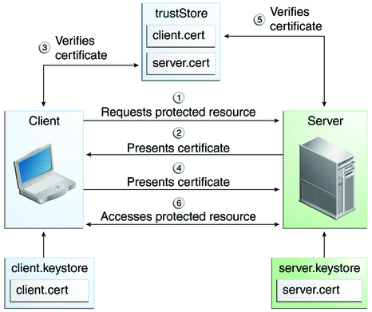
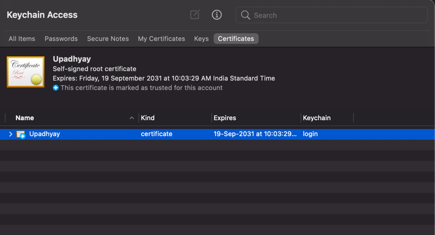
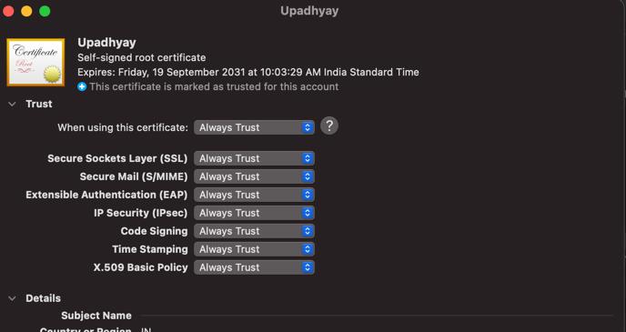

**How to Enable Mutual Auth b/w Client and server**

**What is mTLS or mutual Auth?**

I hope the above steps clears out what is mAuth, now let Begin

**For our use-case we will take Browser as a client and Spring Boot App as server**

Client : Browser
Server : Spring Boot App

Steps:

**Generate JKS[ JAVA KEY STORE ] for Client**

`keytool -genkeypair -alias ks-client -keyalg RSA -keysize 2048 -storetype JKS -keystore ks-client.jks -validity 3650 -ext SAN=dns:localhost,ip:127.0.0.1 
`

**Generate JKS[ JAVA KEY STORE ] for Server**

`keytool -genkeypair -alias ks-server -keyalg RSA -keysize 2048 -storetype JKS -keystore ks-server.jks -validity 3650 -ext SAN=dns:localhost,ip:127.0.0.1
`

**Create public certificate file from client keystore** 

`keytool -export -alias ks-client -file client.crt -keystore ks-client.jks
`

**Create public certificate file from server keystore** 

`keytool -export -alias ks-server -file server.crt -keystore ks-server.jks 
`

**Import Client Cert to Server jks File**

`keytool -import -alias ks-client -file client.crt -keystore ks-server.jks
`

**Import Server Cert to Client jks File**

`keytool -import -alias ks-server -file server.crt -keystore ks-client.jks`

**Now, as we are using chrome as Client which doesn't understand the JKS file, we need to convert ks-client.jks to PCKS12 Format**

`keytool -importkeystore -srckeystore ks-server.jks -destkeystore ks-browser.p12 -srcstoretype JKS -deststoretype PKCS12 -srcstorepass testing -deststorepass testing -srcalias ks-server -destalias ks-browser -srckeypass testing -destkeypass testing -noprompt`

**Last but not the least add the p12 file to keychain**

**Double click on certificate , click on always trust.**

Run Spring boot app

**https://localhost:8090/api/hello**

